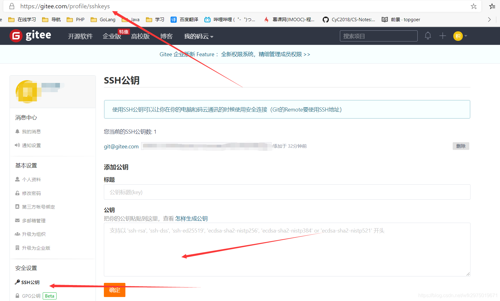
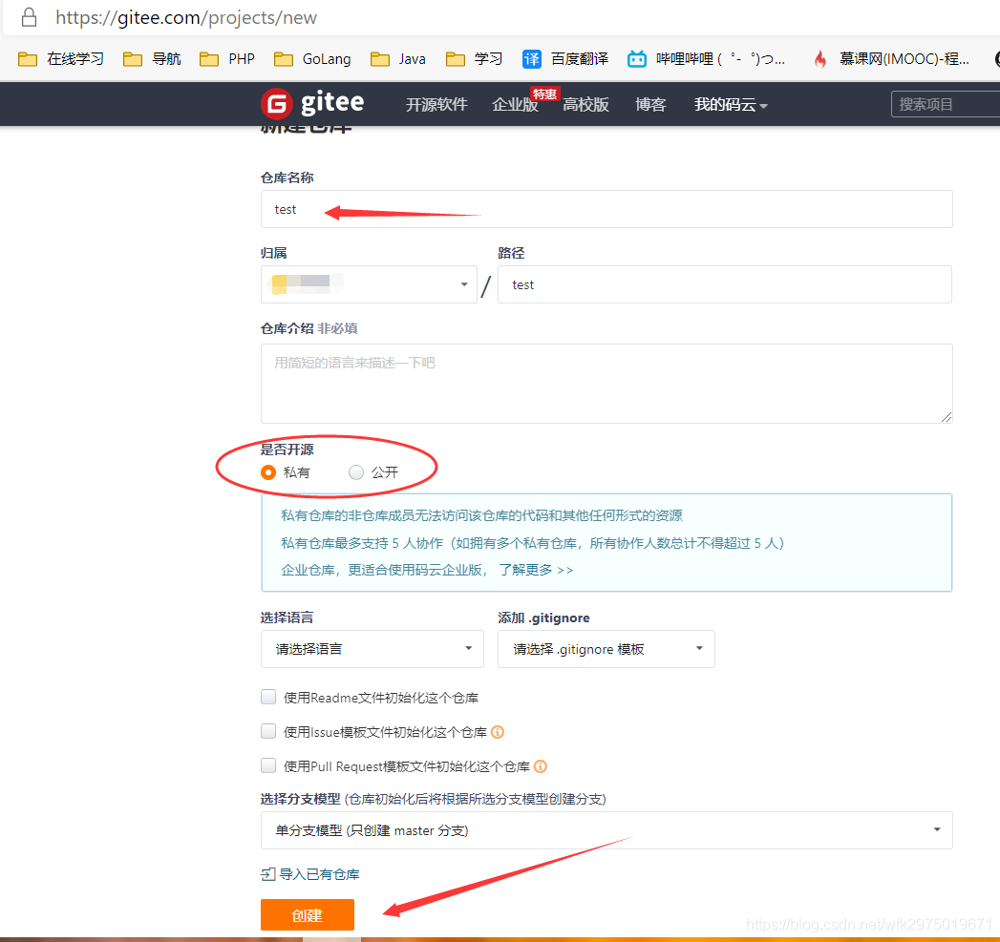

---
title: "Git常见使用方法"
date: 2021-03-24T19:36:38+08:00
draft: true
---

项目以往 gitee提交代码为例子
- 1、创建公钥
```powershell
ssh-keygen -t rsa -C “git@gitee.com”
```
执行完毕该命令后，会在 “/c/Users/xxxx/.ssh/” 目录下面生成3个文件

```powershell
id_rsa
id_rsa.pub
known_hosts
```

- 2、进入将创建好的公钥内容（id_rsa.pub）复制到如下的地址中，这样你就可以有权限对自己的远程仓库进行 **pull** 等操作。


- 3、在gitee上创建自己的仓库，填写仓库名，是否开源等信息


- 4、Git 全局设置:

```powershell
git config --global user.name "积雪草"
git config --global user.email "wfk2975019671@sina.com"
```

- 5、本地没有仓库的话，创建 git 仓库:

```powershell
mkdir test
cd test
git init
touch README.md
git add README.md
git commit -m "first commit"
git remote add origin git@gitee.com:mohuani/test.git
git push -u origin master
```

- 6、本地已有仓库

```powershell
cd existing_git_repo
git remote add origin git@gitee.com:mohuani/test.git
git push -u origin master
```

- 7、分支管理
参考 [廖雪峰老师的文章--Git教程](https://www.liaoxuefeng.com/wiki/896043488029600) 