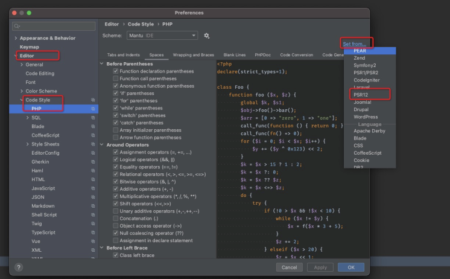

###  PSR 配置

- https://learnku.com/docs/psr

### 插件推荐

- [PHP Annotation](https://plugins.jetbrains.com/plugin/7320-php-annotations)
- [.env files support](https://plugins.jetbrains.com/plugin/9525--env-files-support)
- [BashSupport](https://plugins.jetbrains.com/plugin/4230-bashsupport)
- [IDE Eval Reset](https://plugins.zhile.io)
> 在Settings/Preferences... -> Plugins 内手动添加第三方插件仓库地址：[https://plugins.zhile.io](https://plugins.zhile.io)

- [Rainbow Brackets](https://plugins.jetbrains.com/plugin/10080-rainbow-brackets)
